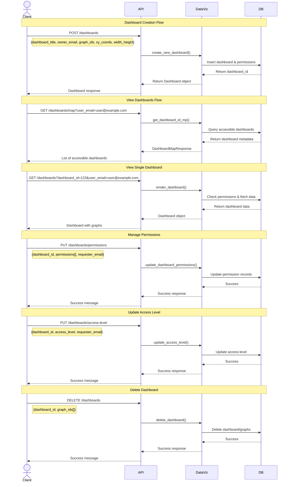
### 1. Overall Architecture

The application follows a three-tier architecture:
```
[Frontend (React)] <---> [Backend (FastAPI)] <---> [Database (SQLite)]
```
#### 1.1 System Architecture Diagram

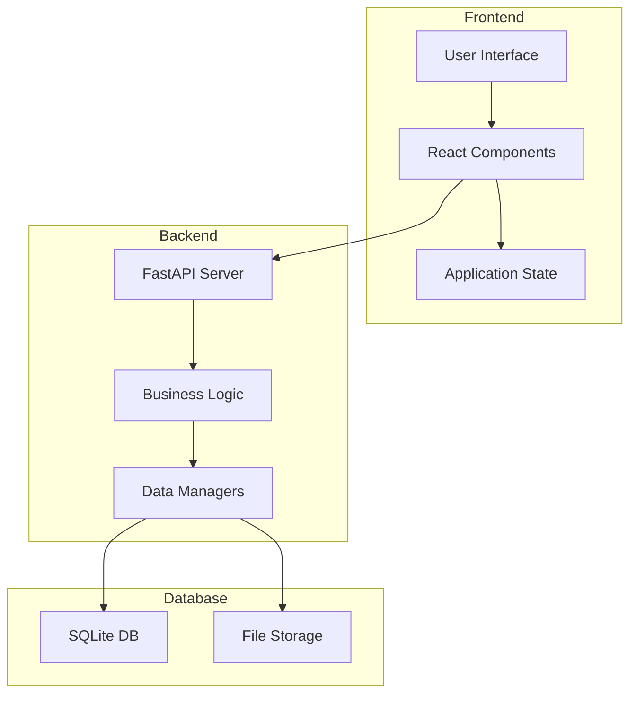
#### 1.2 Overall Component Interaction Flow
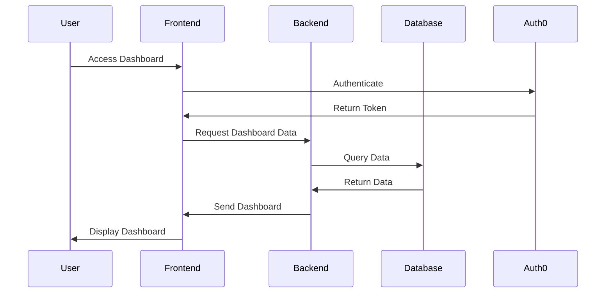

**Key Design Patterns:**
- Facade Pattern (Backend)
- Component-Based Architecture (Frontend)
- Repository Pattern (Data Access)
- MVC Pattern (Overall Structure)

### 2. Frontend Architecture
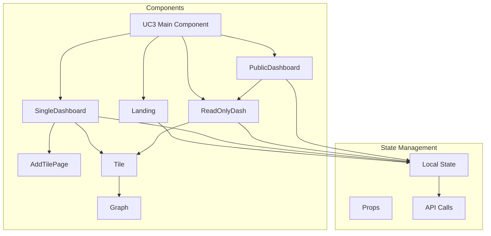

**Detailed Dashboard Card Types:**

1. **OwnerDashboardCard**
```javascript
// Full control over dashboard
- Share functionality
- Manage permissions
- Delete dashboard
- Edit layout
- Add/remove graphs
```

2. **EditDashboardCard**
```javascript
// Can modify but not share/delete
- Edit layout
- Add/remove graphs
- Cannot share with others
- Cannot delete dashboard
```

3. **ViewOnlyDashboardCard**
```javascript
// Can only view
- View graphs
- No edit capabilities
- No sharing permissions
- No delete access
```

4. **CreateDashboardCard**
```javascript
// Special card for creating new dashboards
- "+" icon design
- Creates new dashboard on click
- Always appears first in grid
```


**Component Interaction Model:**

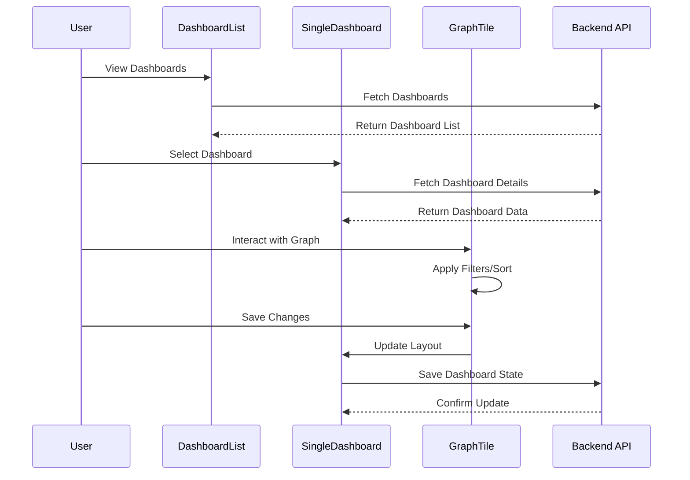


This breakdown shows how the different types of dashboard cards have different capabilities and UI elements based on the user's permission level, making the hierarchy and permission system clearer.

### 3. Backend Architecture

**Technology Stack:**
- FastAPI
- SQLite
- Pydantic for data validation

**Architectural Layers:**

1. **API Layer**
```python
# REST Endpoints
/dashboards           # Dashboard CRUD
/graphs              # Graph management
/tables              # Data source management
/permissions         # Access control
```

2. **Facade Layer (DataVisualizationFacade)**
```python
class DataVisualizationFacade:
    def __init__(self):
        self.dashb_manager = DashboardManager()
        self.graph_manager = GraphManager()
        self.table_manager = TableManager()
```

3. **Manager Layer**
```python
# Handles specific domain operations
- DashboardManager
- GraphManager
- TableManager
```

4. **Data Access Layer**
```python
# Database connection and operations
- SQLite connection management
- SQL query execution
- Data transformation
```
5. **Backend Architecture**

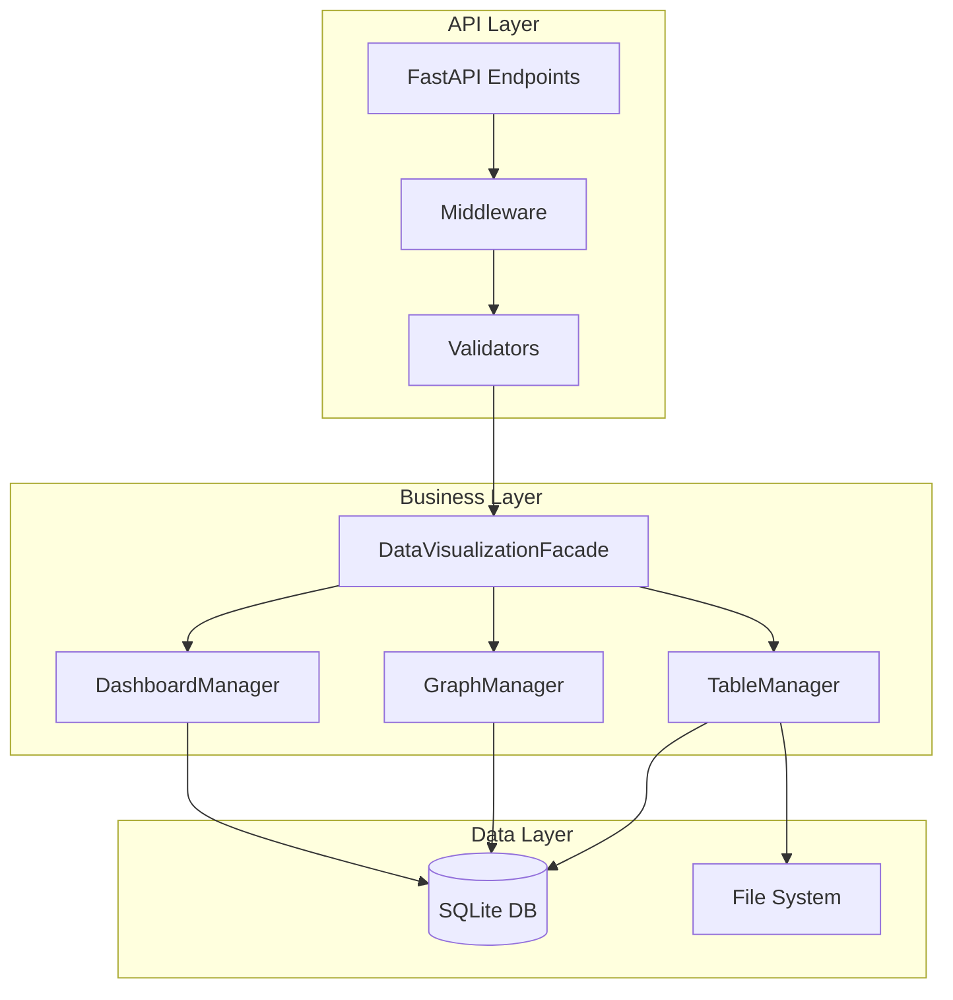
   

### 4. Database Design

**Core Tables:**
```sql
1. dashboard_permissions
   - dashboard_id (PK, FK)
   - user_email
   - permission_type

2. dashboard_title_mp
   - dashboard_id (PK)
   - dashboard_title

3. master_dashboard
   - dashboard_id (FK)
   - graph_id (FK)
   - width, height
   - x_coord, y_coord

4. graphs
   - graph_id (PK)
   - graph_title
   - graph_type
   - table_id (FK)
   - ax0, ax1

5. tables
   - table_id (PK)
   - table_name

6. table_data
   - table_id (FK)
   - column_name
   - value
```

### 5. Key Features & Workflows

1. **Dashboard Management**
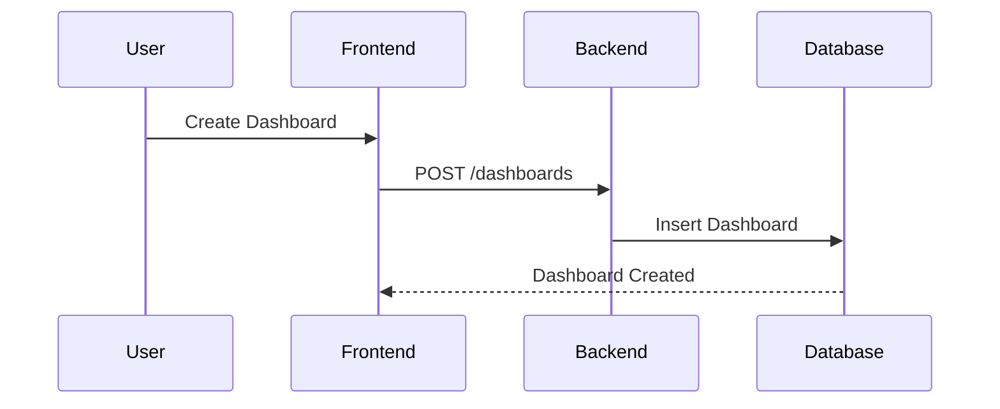

2. **Permission Control**


3. **Graph Creation**
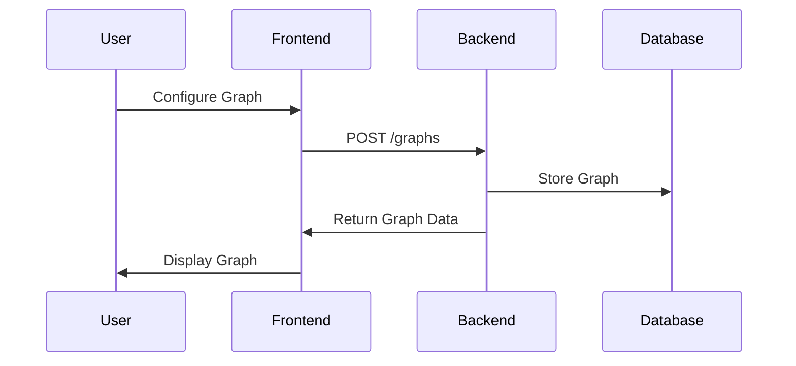


### 6. Technology Architecture

#### 6.1 Web Application Architecture
Detailed component breakdown:

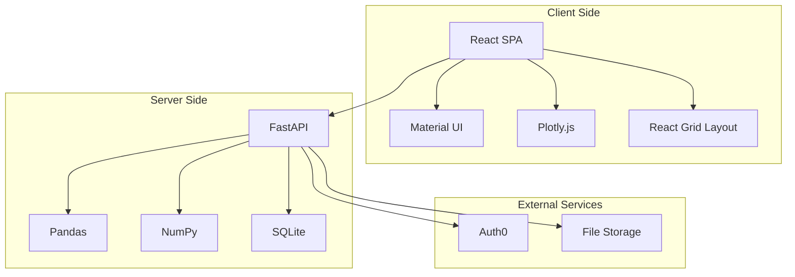

#### 6.2 Data Flow Architecture

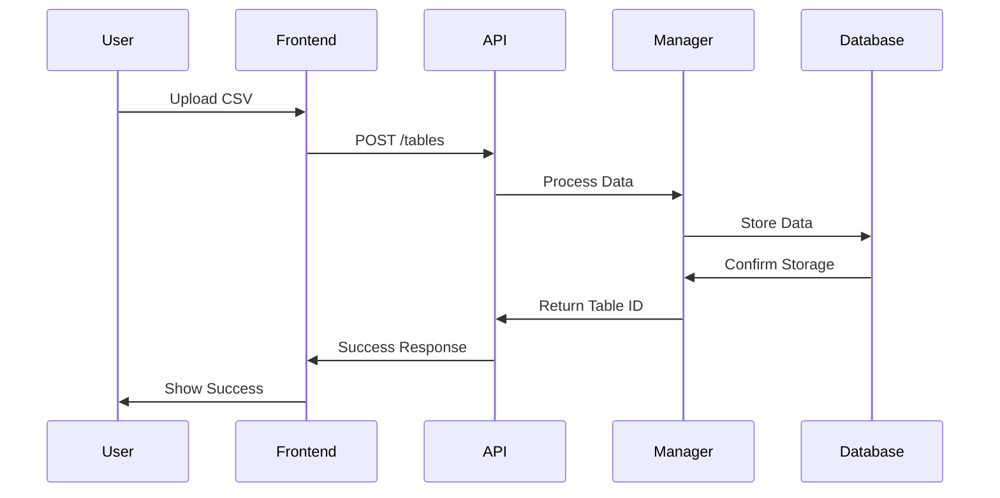


### 7. Database Schema

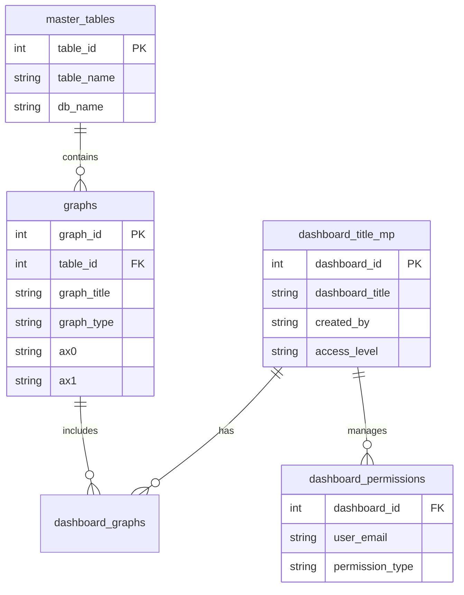

### 8. Key Features Implementation

#### Dashboard Creation Flow

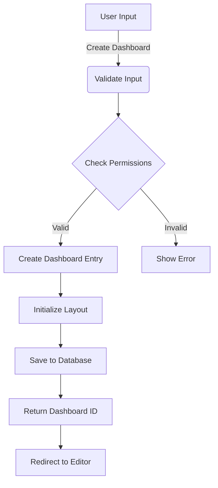

#### Permission Management System
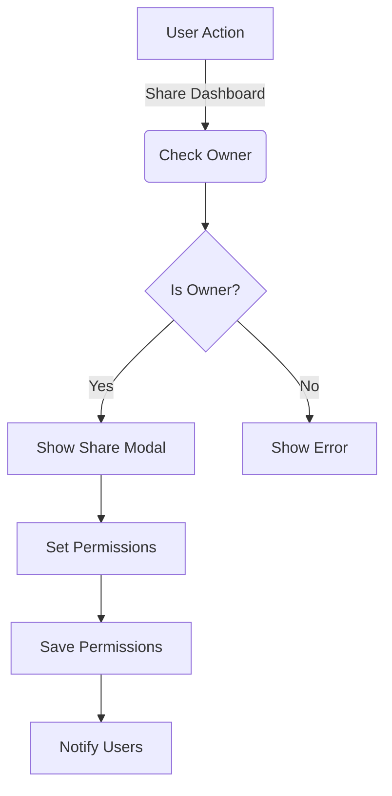

### 9. Security & Performance

**Security Measures:**
1. Permission-based access control
2. Input validation using Pydantic
3. SQL injection prevention
4. CORS configuration

**Performance Optimizations:**
1. Efficient SQL queries with JOINs
2. Frontend component memoization
3. Optimized re-rendering
4. Lazy loading of dashboard data

### 10. Error Handling

1. **Frontend:**
```javascript
try {
    // API calls with axios
} catch (error) {
    // Error handling and user feedback
}
```

2. **Backend:**
```python
@app.exception_handler(HTTPException)
async def http_exception_handler(request, exc):
    return JSONResponse(
        status_code=exc.status_code,
        content={"detail": exc.detail}
    )
```

