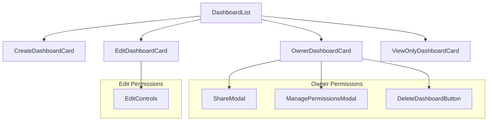
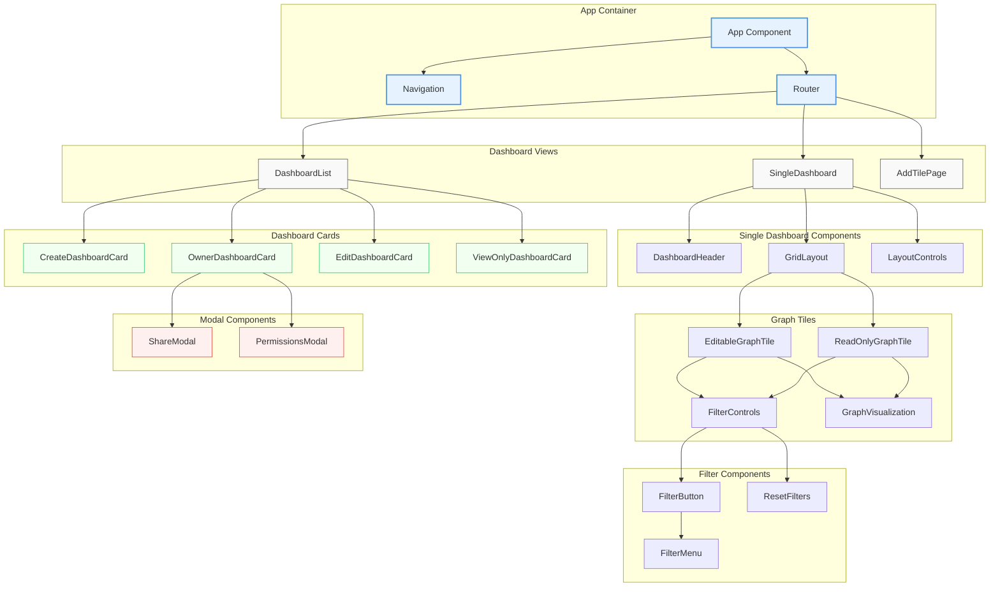
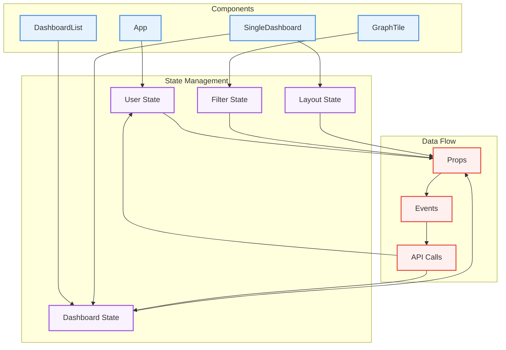
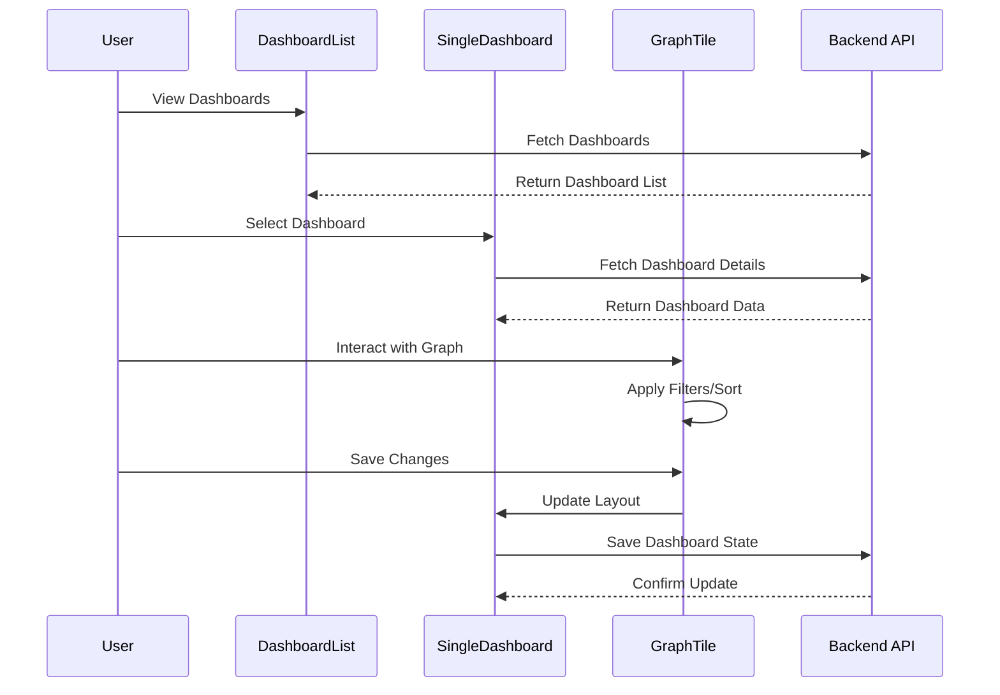
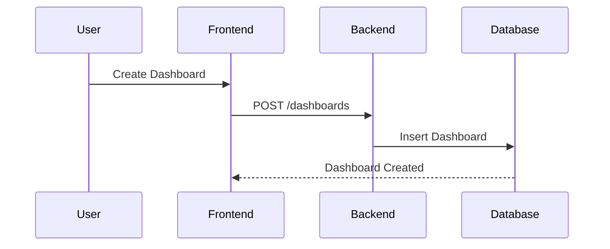
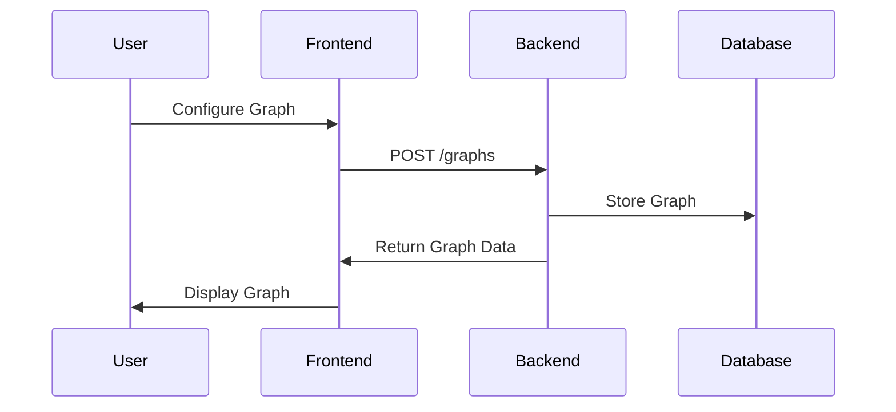

### 1. Overall Architecture

The application follows a three-tier architecture:
```
[Frontend (React)] <---> [Backend (FastAPI)] <---> [Database (SQLite)]
```

**Key Design Patterns:**
- Facade Pattern (Backend)
- Component-Based Architecture (Frontend)
- Repository Pattern (Data Access)
- MVC Pattern (Overall Structure)

### 1. Frontend Architecture
```
App
├── Navigation
│   └── NavigationBar
├── DashboardList (MyDashboards)
│   ├── DashboardCards
│   │   ├── OwnerDashboardCard
│   │   │   ├── ShareModal
│   │   │   │   ├── EmailInput
│   │   │   │   └── PermissionSelect
│   │   │   ├── ManagePermissionsModal
│   │   │   │   ├── PermissionsList
│   │   │   │   └── DeletePermissionButton
│   │   │   └── DeleteDashboardButton
│   │   ├── EditDashboardCard
│   │   │   └── EditControls
│   │   └── ViewOnlyDashboardCard
│   └── CreateDashboardCard
├── SingleDashboard
│   ├── DashboardHeader
│   │   ├── EditView
│   │   │   ├── AddTileButton
│   │   │   ├── EditTitleButton
│   │   │   └── SaveLayoutButton
│   │   └── ReadOnlyView
│   │       └── DashboardTitle
│   ├── GridLayout
│   │   ├── EditableGraphTile
│   │   ├── GraphVisualization
│   │   ├── TileControls
│   │   │   ├── ResizeHandle
│   │   │   ├── DragHandle
│   │   │   └── DeleteButton
│   │   ├── FilterControls
│   │   │   │   ├── FilterButton
│   │   │   │   │   └── FilterMenu
│   │   │   │   │       ├── DateRangeFilter
│   │   │   │   │       ├── CategoryFilter
│   │   │   │   │       └── ApplyFilterButton
│   │   │   │   ├── SortButton
│   │   │   │   │   └── SortMenu
│   │   │   │   │       ├── SortByOptions
│   │   │   │   │       └── SortDirectionToggle
│   │   │   │   └── ResetFiltersButton
│   │   │   └── EditGraphSettings
│   │   │       ├── TitleEdit
│   │   │       └── GraphTypeEdit
│   │   └── ReadOnlyGraphTile
│   │       ├── GraphVisualization
│   │       ├── TileInfo
│   │       └── FilterControls // Same as EditableGraphTile
│   └── LayoutControls
│        ├── EditView
│        │   ├── SaveLayout
│        │   └── ResetLayout
│        └── ReadOnlyView
│            └── ViewModeIndicator
├── AddTilePage
│   ├── TableSelector
│   │   └── TableList
│   ├── ChartTypeSelector
│   │   └── ChartTypeOptions
│   ├── AxisSelector
│   │   ├── XAxisSelect
│   │   └── YAxisSelect
│   └── PreviewSection
│       └── GraphPreview
└── ErrorBoundary
    └── ErrorDisplay
```

**Detailed Dashboard Card Types:**

1. **OwnerDashboardCard**
```javascript
// Full control over dashboard
- Share functionality
- Manage permissions
- Delete dashboard
- Edit layout
- Add/remove graphs
```

2. **EditDashboardCard**
```javascript
// Can modify but not share/delete
- Edit layout
- Add/remove graphs
- Cannot share with others
- Cannot delete dashboard
```

3. **ViewOnlyDashboardCard**
```javascript
// Can only view
- View graphs
- No edit capabilities
- No sharing permissions
- No delete access
```

4. **CreateDashboardCard**
```javascript
// Special card for creating new dashboards
- "+" icon design
- Creates new dashboard on click
- Always appears first in grid
```

**Visual Representation:**



**Detailed Visual Representation of Frontend Architecture:**



**Component State Flow:**



**Component Interaction Model:**



**Permission-Based Rendering:**
```javascript
function DashboardCard({ dashboard, permissionType }) {
    switch(permissionType) {
        case 'owner':
            return <OwnerDashboardCard dashboard={dashboard} />;
        case 'edit':
            return <EditDashboardCard dashboard={dashboard} />;
        case 'view':
            return <ViewOnlyDashboardCard dashboard={dashboard} />;
        default:
            return null;
    }
}
```

**Card-Specific Features:**

1. **OwnerDashboardCard Features:**
```javascript
const OwnerDashboardCard = ({ dashboard }) => {
    return (
        <Card>
            <CardHeader 
                action={
                    <>
                        <ShareButton />
                        <ManagePermissionsButton />
                        <DeleteButton />
                    </>
                }
            />
            <CardContent>
                // Dashboard content
            </CardContent>
        </Card>
    );
};
```

2. **EditDashboardCard Features:**
```javascript
const EditDashboardCard = ({ dashboard }) => {
    return (
        <Card>
            <CardHeader 
                action={
                    <EditControls />
                }
            />
            <CardContent>
                // Dashboard content
            </CardContent>
        </Card>
    );
};
```

3. **ViewOnlyDashboardCard Features:**
```javascript
const ViewOnlyDashboardCard = ({ dashboard }) => {
    return (
        <Card>
            <CardHeader />
            <CardContent>
                // Dashboard content
            </CardContent>
        </Card>
    );
};
```

4. **CreateDashboardCard Features:**
```javascript
const CreateDashboardCard = () => {
    return (
        <Card>
            <CardActionArea onClick={handleCreate}>
                <AddIcon />
                <Typography>
                    Create New Dashboard
                </Typography>
            </CardActionArea>
        </Card>
    );
};
```

This breakdown shows how the different types of dashboard cards have different capabilities and UI elements based on the user's permission level, making the hierarchy and permission system clearer.

### 3. Backend Architecture

**Technology Stack:**
- FastAPI
- SQLite
- Pydantic for data validation

**Architectural Layers:**

1. **API Layer**
```python
# REST Endpoints
/dashboards           # Dashboard CRUD
/graphs              # Graph management
/tables              # Data source management
/permissions         # Access control
```

2. **Facade Layer (DataVisualizationFacade)**
```python
class DataVisualizationFacade:
    def __init__(self):
        self.dashb_manager = DashboardManager()
        self.graph_manager = GraphManager()
        self.table_manager = TableManager()
```

3. **Manager Layer**
```python
# Handles specific domain operations
- DashboardManager
- GraphManager
- TableManager
```

4. **Data Access Layer**
```python
# Database connection and operations
- SQLite connection management
- SQL query execution
- Data transformation
```

### 4. Database Design

**Core Tables:**
```sql
1. dashboard_permissions
   - dashboard_id (PK, FK)
   - user_email
   - permission_type

2. dashboard_title_mp
   - dashboard_id (PK)
   - dashboard_title

3. master_dashboard
   - dashboard_id (FK)
   - graph_id (FK)
   - width, height
   - x_coord, y_coord

4. graphs
   - graph_id (PK)
   - graph_title
   - graph_type
   - table_id (FK)
   - ax0, ax1

5. tables
   - table_id (PK)
   - table_name

6. table_data
   - table_id (FK)
   - column_name
   - value
```

### 5. Key Features & Workflows

1. **Dashboard Management**


2. **Permission Control**


3. **Graph Creation**


### 6. Security & Performance

**Security Measures:**
1. Permission-based access control
2. Input validation using Pydantic
3. SQL injection prevention
4. CORS configuration

**Performance Optimizations:**
1. Efficient SQL queries with JOINs
2. Frontend component memoization
3. Optimized re-rendering
4. Lazy loading of dashboard data

### 7. Error Handling

1. **Frontend:**
```javascript
try {
    // API calls with axios
} catch (error) {
    // Error handling and user feedback
}
```

2. **Backend:**
```python
@app.exception_handler(HTTPException)
async def http_exception_handler(request, exc):
    return JSONResponse(
        status_code=exc.status_code,
        content={"detail": exc.detail}
    )
```

